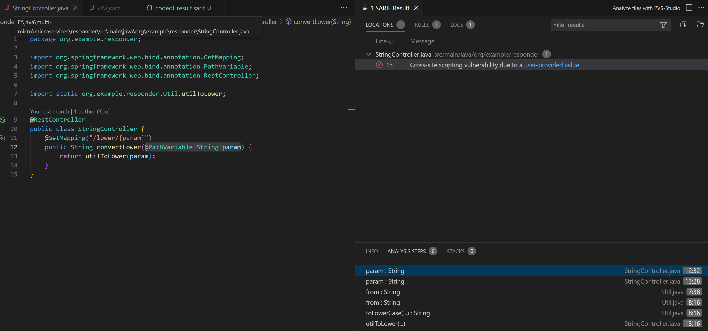
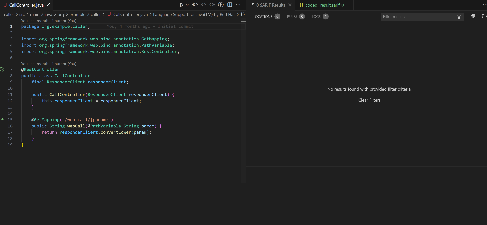
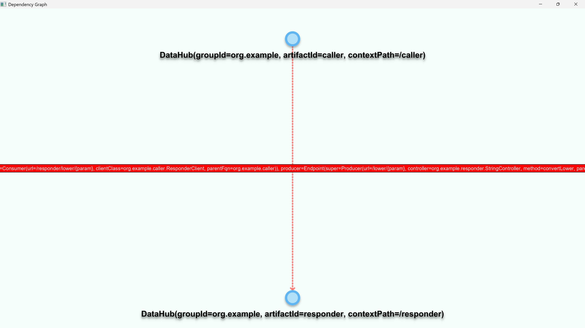
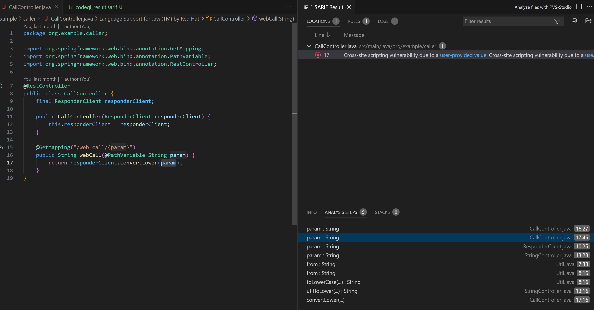

# Quick Start Instructions
## Testing using demo application

### Prerequisites:
- [JDK 21](https://github.com/corretto/corretto-21/releases)
- [Maven 3.9](https://maven.apache.org/download.cgi)
- [JavaFX 21.0.8+ (SDK)](https://gluonhq.com/products/javafx/)
- [CodeQL bundle](https://github.com/github/codeql-action/releases/)
- [Visual Studio Code](https://code.visualstudio.com/Download) with [CodeQL extension](https://marketplace.visualstudio.com/items?itemName=GitHub.vscode-codeql)

### Procedure:

1- Add JDK to PATH and test it
```
> java -version

openjdk version "21.0.7" 2025-04-15 LTS
OpenJDK Runtime Environment Corretto-21.0.7.6.1 (build 21.0.7+6-LTS)
OpenJDK 64-Bit Server VM Corretto-21.0.7.6.1 (build 21.0.7+6-LTS, mixed mode, sharing)
```

2- Add CodeQL to your PATH and test it
```
> codeql
This CodeQL Distribution is installed in 'xxx', which is a root filesystem directory. This could cause performance issues. Consider moving to a new location outside of the root, downloads or desktop directory. Alternatively, set the 'CODEQL_ALLOW_INSTALLATION_ANYWHERE' environment variable to 'true' to avoid seeing this message again.
Usage: codeql <command> <argument>...
Create and query CodeQL databases, or work with the QL language.
```
3- Clone the demo project
```
> git clone https://github.com/ahmedyarub/distributed-app
```

4- Check whether the projects can be built successfully
```
> cd distributed-app/microservices/responder
> mvn clean install
.
.
.
[INFO] BUILD SUCCESS
[INFO] ------------------------------------------------------------------------
[INFO] Total time:  1.966 s
[INFO] Finished at: 2025-09-08T20:10:07-03:00
[INFO] ------------------------------------------------------------------------
```
```
> cd distributed-app/microservices/caller
> mvn clean install
.
.
.
[INFO] BUILD SUCCESS
[INFO] ------------------------------------------------------------------------
[INFO] Total time:  1.966 s
[INFO] Finished at: 2025-09-08T20:10:07-03:00
[INFO] ------------------------------------------------------------------------
```
5- Create the CodeQL analysis database
```
> cd distributed-app/microservices/caller
> codeql database create --language=java-kotlin .../codeql-dbs/caller
.
.
.
TRAP import complete (2.7s).
Finished zipping source archive (3.08 KiB).
Successfully created database at .../codeql-dbs/caller
```
```
> cd distributed-app/microservices/responder
> codeql database create --language=java-kotlin .../codeql-dbs/responder
.
.
.
TRAP import complete (1.1s).
Finished zipping source archive (2.95 KiB).
Successfully created database at .../codeql-dbs/responder.
```
6- Analyze the created databases
```
> cd distributed-app/microservices/caller
> codeql database analyze .../codeql-dbs/caller --format=sarif-latest --output="...distributed-app/microservices/caller/codeql_result.sarif" java-lgtm-full --no-sarif-minify --sarif-add-snippets
.
.
.
Shutting down query evaluator.
Interpreting results.
```
```
> cd distributed-app/microservices/responder
> codeql database analyze .../codeql-dbs/responder --format=sarif-latest --output="...distributed-app/microservices/responder/codeql_result.sarif" java-lgtm-full --no-sarif-minify --sarif-add-snippets
.
.
.
Shutting down query evaluator.
Interpreting results.
```
7- Open the projects folder and then open each codeql_result.sarif file.

Notice that although the analysis of responder-service does find the XSS vulnerability...

It does not propagate the detected vulnerability to the consumer caller-service
8- Now let's run the API Guard's dependency analyzer
```
> cd analysers/java/ 
> java.exe --module-path '.../javafx-sdk-21.0.8/lib' --add-modules javafx.controls,javafx.fxml -jar 'java_analyser.jar'
```
9- Open the `distributed-app` folder and click on Analyze!. Notice how it builds the cross-service dependency graph.

The dependency analyzer of API Guard detects the inter-service dependencies.

10- Now redo the static analysis using API Guard
```
.\api_guard.exe --projects_path .../distributed-app/microservices --dbs_path .../codeql-dbs --javafx_path .../javafx-sdk-21.0.8
.
.
.
Finalizing database
Analyzing project
```
11- Open `codeql_result.sarif` files which can be found in the folder of each project, and notice how CodeQL can now locate cross-service vulnerabilities with the aid of API Guard.

